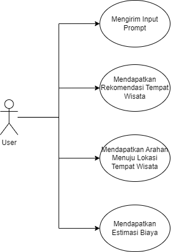
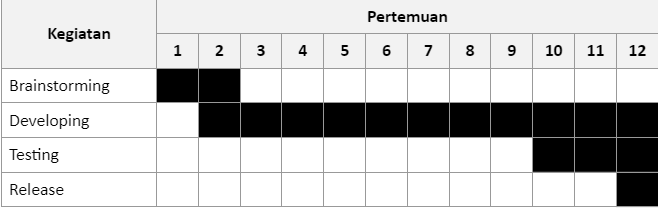

# Nama Kelompok: TourTech

## Anggota Kelompok
- Haikal Hilmi - 21/482625/TK/53328
- Ega Rizky Setiawan - 21/479314/TK/52861
- Thoriqutsani Anastyo Rasnan - 21/479154/TK/52816

## Project: Senior Project TI

## Departemen
Teknologi Teknik Elektro dan Teknologi Informasi, Fakultas Teknik, Universitas Gadjah Mada

## DestiSmart
- **Jenis Produk**: Travel Advisor
- **Latar Belakang**:
  Indonesia memiliki berbagai ragam geografis, geologis, sosial, dan budaya, yang menjadikan negara ini memiliki banyak sektor pariwisata. Namun, banyak sektor pariwisata yang kurang dikembangkan dan diperhatikan oleh pemerintah, sehingga banyak tempat wisata yang tidak diketahui oleh para wisatawan. Di sisi lain, para turis seringkali bingung dalam membuat perencanaan wisata. Oleh karena itu, kami menawarkan solusi berupa aplikasi web dengan AI yang dapat memberikan rekomendasi tempat wisata lokal kepada calon pengunjung, sehingga mereka dapat membuat perencanaan wisata yang matang. Dengan implementasi solusi ini, diharapkan sektor pariwisata lokal dapat tumbuh pesat dan kesejahteraan masyarakat setempat meningkat.
- **Rumusan Permasalahan**:
  - Kurangnya perhatian pemerintah terhadap tempat wisata lokal
  - Tantangan dalam memperkenalkan tempat wisata lokal kepada wisatawan luar daerah
  - Perencanaan wisata yang membutuhkan waktu dari sisi turis
- **Ide Solusi**: Aplikasi web dengan berbasis AI dalam penentuan wisata lokal daerah
- **Rancangan Fitur Solusi**:
  
  | Fitur                 | Keterangan |
  |-----------------------|------------|
  | Rekomendasi Wisata    | Memberikan saran perjalanan oleh AI yang dipilih dari opsi yang diberikan oleh aplikasi untuk mendapatkan insight tentang wisata yang dituju dengan rencana perjalanan yang baik.   |
  | Rencana Wisata        | Memberikan perencanaan dari berangkat sampai pulang sehingga user tidak perlu memikirkan banyak hal dalam perencanaan wisata.   |
  | Narasi Interaktif     | Memberikan tour guide pada narasi informatif jika berkunjung pada tempat bersejarah, budaya, dan fakta-fakta unik setiap tempat wisata.   |
  
- **Analisis Kompetitor**:
  
  | Nama        | Jenis Kompetitor | Jenis Produk | Target Customer | Kelebihan | Kekurangan | Key Competitive Advantage & Unique Value |
  |-------------|-------------------|--------------|-----------------|-----------|------------|-----------------------------------------|
  | Google Maps | Indirect          | Aplikasi peta digital dan navigasi yang menyediakan informasi tentang lokasi, arah, dan transportasi umum. | Pengguna yang ingin mencari lokasi dan review dari lokasi tersebut. | - Memetakan posisi dari tempat pariwisata yang dituju - Dapat mencarikan rekomendasi jalur menuju destinasi - Navigasi realtime | - Review pelanggan yang kurang objektif terhadap tempat yang tidak mereka sukai - Petunjuk arah yang sering salah apabila berada di tempat yang jauh dari perkotaan - Kurangnya saran akan tempat pariwisata sesuai keinginan pengguna | Google Maps menonjol dalam penyediaan informasi lalu lintas secara real-time dan kemudahan akses karena dapat diakses dari berbagai platform yang berbeda.   |
  | Traveloka | Direct          | Platform pemesanan tiket pesawat, hotel, paket wisata, dan penyewaan kendaraan. | Pengguna yang mencari berbagai layanan perjalanan seperti tiket pesawat, hotel, paket wisata, dan penyewaan kendaraan dalam satu platform | -  Komprehensif: menawarkan berbagai layanan perjalanan dalam satu platform, mulai dari tiket pesawat, hotel, paket wisata, hingga penyewaan kendaraan. - Fleksibilitas Pembayaran: Memberikan berbagai opsi pembayaran yang fleksibel, termasuk pembayaran dengan cicilan kartu kredit. | - Kompetisi Harga: Kadang-kadang harga di Traveloka dapat lebih tinggi dibandingkan dengan pesaing, terutama saat tidak ada promosi atau diskon - Keterbatasan Pilihan: Meskipun komprehensif, Traveloka mungkin tidak selalu memiliki pilihan terbaik untuk setiap tujuan atau layanan tertentu. | Traveloka menonjol dalam menyediakan platform yang menyatukan berbagai layanan perjalanan, memberikan pengguna akses mudah dan praktis untuk memesan segala kebutuhan perjalanan mereka dalam satu tempat. Dengan fokus pada promosi dan diskon, serta opsi pembayaran yang fleksibel, Traveloka berupaya untuk memberikan nilai tambah kepada pengguna dalam hal kenyamanan dan potensi penghematan dalam perjalanan mereka. |
  | ChatGPT | Indirect          | Platform AI chatbot | Pengguna yang membutuhkan layanan informasi secara cepat. | - Kemampuan beradaptasi - 24/7 ketersediaan  - Kegunaan yang beragam | - Data tempat pariwisata kurang lengkap - Keterbatasan interaksi kepada pengguna selain teks dan tidak cocok untuk pariwisata | ChatGPT menonjol dalam memberikan solusi dan informasi yang relevan dan cepat melalui interaksi berbasis teks. Keunggulan utamanya adalah kemampuan beradaptasi dan ketersediaan 24/7, serta kemampuan untuk digunakan dalam berbagai konteks. Namun, seperti yang disebutkan sebelumnya, ChatGPT juga memiliki keterbatasan dalam interaksi dan pengetahuan yang perlu dipertimbangkan.   |
  
- **Tujuan Produk**: Memperkenalkan tempat wisata lokal kepada wisatawan luar daerah

- **Pengguna potensial**: Wisatawan luar daerah

- **Use Case Diagram**:

  
  
- **Functional Requirements**

  | FR    | Deskripsi   |
  |-------|-------------|
  | FR 1  | Aplikasi dapat menerima input prompt dari user  |
  | FR 2  | Aplikasi dapat memberikan rekomendasi tempat wisata sesuai dengan input prompt yang diberikan oleh user  |
  | FR 3  | Aplikasi mampu memberikan arahan untuk menuju lokasi tempat wisata yang direkomendasikan  |
  | FR 4  | Aplikasi dapat memberikan estimasi biaya yang dibutuhkan oleh user untuk mengunjungi tempat wisata yang direkomendasikan |

- **Gantt-Chart**:

  
